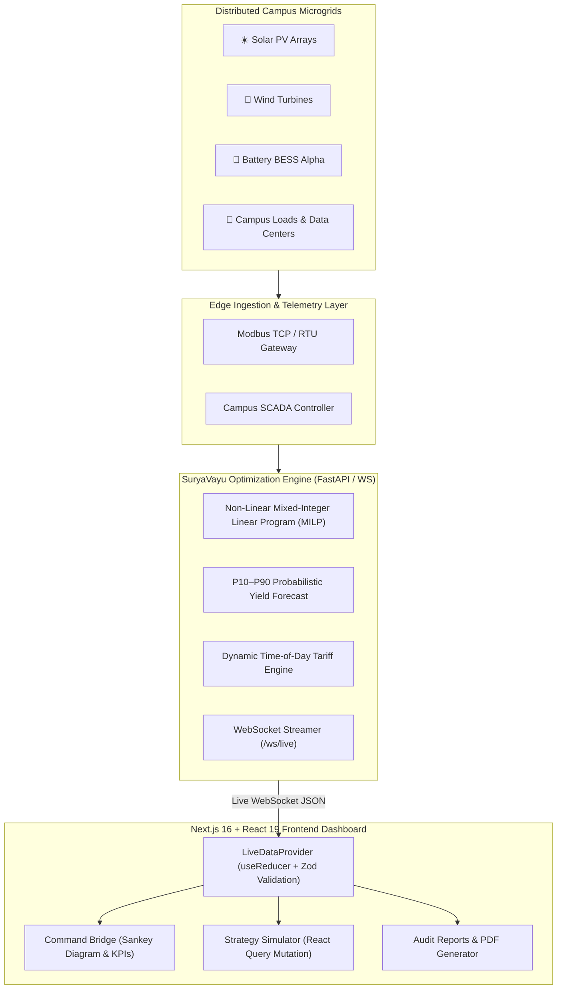

# SuryaVayu: Virtual Power Plant (VPP) Control Cell

> **Directorate of Technical Education (DTE) · Government of Rajasthan**  
> *Autonomous Multi-Campus Renewable Energy Orchestration Engine (SVH-26004)*

---

## 🌟 Project Overview

**SuryaVayu** is an enterprise-grade Virtual Power Plant (VPP) and Microgrid Energy Management System designed to aggregate, balance, and optimize distributed solar, wind, and battery energy storage system (BESS) assets across technical education campuses in Rajasthan (MNIT Jaipur, GEC Ajmer, CTAE Udaipur, JECRC, BIT Jaipur).

### Key Features:
- **Command Bridge Dashboard:** Real-time power flow distribution with interactive Sankey diagrams, live grid interconnect tracking, and AI-prioritized dispatch directives.
- **Strategy Simulator:** Non-linear multi-objective optimization engine with interactive parameter tuning for storage capacity, export limits, carbon pricing, and critical loads.
- **Audit & Analytics Reports:** Historical generation and financial ledger with instant one-click A4 Landscape PDF export with official Government of Rajasthan branding.
- **WebSocket Pipeline:** Real-time telemetry streaming with Zod schema validation, $<200\text{ms}$ latency monitoring, and automatic exponential backoff reconnection.

---

## 🏗️ System Architecture



---

## ⚙️ Environment Variables

Create a `.env.local` file in the project root:

| Variable | Required | Default | Description |
| :--- | :---: | :--- | :--- |
| `NEXT_PUBLIC_API_URL` | Optional | `http://localhost:8000` | Backend REST API endpoint for simulator optimization |
| `NEXT_PUBLIC_WS_URL` | Optional | `ws://localhost:8000/ws/live` | WebSocket endpoint for real-time telemetry streaming |

---

## 🚀 Local Development Setup

### Prerequisites:
- **Node.js**: v20.x or v22.x
- **npm**: v10.x or higher

### Steps:

1. **Clone the repository:**
   ```bash
   git clone https://github.com/your-org/suryavayu-vpp.git
   cd suryavayu-vpp
   ```

2. **Install dependencies:**
   ```bash
   npm install
   ```

3. **Run development server:**
   ```bash
   npm run dev
   ```

4. **Open in browser:**
   Navigate to [http://localhost:3000](http://localhost:3000).

---

## 🐳 Docker Containerization (Multi-Stage)

Build and run using the optimized multi-stage Dockerfile:

```bash
# 1. Build Docker image
docker build -t suryavayu-vpp .

# 2. Run Container on port 3000
docker run -d -p 3000:3000 --name suryavayu-app suryavayu-vpp
```

---

## ☁️ Vercel Deployment Guide

1. **Push your code to GitHub / GitLab / Bitbucket.**
2. **Import project into Vercel:**
   - Framework Preset: `Next.js`
   - Root Directory: `./`
3. **Configure Environment Variables:**
   - Add `NEXT_PUBLIC_API_URL` and `NEXT_PUBLIC_WS_URL` in the Vercel Project Settings.
4. **Deploy:**
   - Click **Deploy**. Vercel will automatically build and serve the optimized standalone Next.js application.

---

## 🏛️ Government Compliance & Design System

- **Official Colors:**
  - Solar Yield: `#f5a623` (Amber)
  - Wind Velocity: `#14b8a6` (Teal)
  - Grid Interconnect: `#3b82f6` (Blue)
  - BESS Storage: `#22c55e` (Emerald)
- **Typography:** Inter (Google Fonts)
- **Component System:** TailwindCSS v4 + Shadcn UI + Framer Motion
