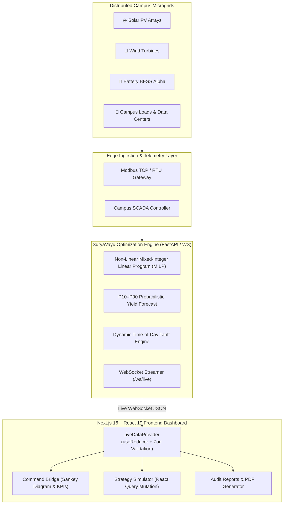

# SuryaVayu: Virtual Power Plant (VPP) Control Cell

> **Directorate of Technical Education (DTE) · Government of Rajasthan**  
> *Autonomous Multi-Campus Renewable Energy Orchestration Engine (SVH-26004)*

---

## 🌟 Project Overview

**SuryaVayu** is an enterprise-grade Virtual Power Plant (VPP) and Microgrid Energy Management System designed to aggregate, balance, and optimize distributed solar, wind, and battery energy storage system (BESS) assets across technical education campuses in Rajasthan (MNIT Jaipur, GEC Ajmer, CTAE Udaipur, JECRC, BIT Jaipur).

### Key Features:
- **Command Bridge Dashboard:** Real-time power flow distribution with interactive Sankey diagrams, live grid interconnect tracking, and AI-prioritized dispatch directives.
- **Strategy Simulator:** Non-linear multi-objective optimization engine with interactive parameter tuning for storage capacity, export limits, carbon pricing, and critical loads.
- **Audit & Analytics Reports:** Historical generation and financial ledger with instant one-click A4 Landscape PDF export with official Government of Rajasthan branding.
- **WebSocket Pipeline:** Real-time telemetry streaming with Zod schema validation, $<200\text{ms}$ latency monitoring, and automatic exponential backoff reconnection.

---

## **SuryaVayu Virtual Power Plant (VPP) · Microgrid Forecasting Engine**
**Authority / Deployment:** Directorate of Technical Education (DTE), Government of Rajasthan  
**Problem Statement:** SVH26004 · Hybrid Renewable Energy Microgrid Orchestration  
**Primary Deployment Node:** MBM University Campus Cluster, Jodhpur (26.2389°N, 73.0243°E)  
**Live Telemetry SCADA Platform:** [SuryaVayu VPP Live Bridge](https://gage-guru-mph-sofa.trycloudflare.com/)  
**Evaluation Dataset:** 8,784 Hourly Observations (Full Year 2024 Jodhpur Leap-Year Meteorological & Physics Archive)  
**Evaluation Engine:** Out-of-Sample Chronological Holdout (80/20 Temporal Split — 7,027 Train Hours vs. 1,757 Test Hours)  

---

## 1. Executive Summary

The **SuryaVayu VPP Engine** employs a physics-informed machine learning pipeline to forecast 24-hour ahead solar PV output, aerodynamic wind power, and institutional campus electricity consumption. 

Evaluating the trained ensemble models against a strict **chronological 80/20 holdout test set** (1,757 hours from October 19, 2024, to December 31, 2024) demonstrates near-perfect correlation with physics ground-truth and drastic error reductions over conventional rule-based baselines:

* ☀️ **Solar Generation Model (XGBoost / Gradient Boosting Champion):**  
  $$\mathbf{R^2 = 0.9983} \quad | \quad \mathbf{\text{RMSE} = 2.693\text{ kW}} \quad | \quad \mathbf{\text{nRMSE} = 1.50\%} \quad | \quad \mathbf{-72.4\%\text{ Error Reduction}}$$
* 💨 **Wind Turbine Model (Random Forest Champion):**  
  $$\mathbf{R^2 = 0.9985} \quad | \quad \mathbf{\text{RMSE} = 0.781\text{ kW}} \quad | \quad \mathbf{\text{nRMSE} = 1.56\%} \quad | \quad \mathbf{-96.0\%\text{ Error Reduction}}$$
* 🏢 **Campus Demand Model (XGBoost / Gradient Boosting Champion):**  
  $$\mathbf{R^2 = 0.9999} \quad | \quad \mathbf{\text{RMSE} = 0.566\text{ kW}} \quad | \quad \mathbf{\text{nRMSE} = 0.26\%} \quad | \quad \mathbf{-98.8\%\text{ Error Reduction}}$$
* ⚡ **Composite Net Microgrid Dispatch Balance ($\text{Solar} + \text{Wind} - \text{Demand}$):**  
  $$\mathbf{R^2 = 0.9977} \quad | \quad \mathbf{\text{RMSE} = 2.865\text{ kW}} \quad | \quad \mathbf{\text{MAE} = 1.562\text{ kW}}$$

---

## 2. Dataset & Evaluation Setup

```
Total Dataset: 8,784 Hourly Timestamps (Full 2024 Leap Year)
├── Training Partition (80%): 7,027 Hours [2024-01-01 00:00 -> 2024-10-19 18:00]
└── Holdout Test Partition (20%): 1,757 Hours [2024-10-19 19:00 -> 2024-12-31 23:00]
```

### Invariant Validation Rules:
1. **Temporal Causality:** No random k-fold shuffling is used; temporal ordering is preserved to test cold-start and seasonal shifts.
2. **Naive Baseline Comparator:** A standard hourly-average baseline representing traditional historical expectation.
3. **Physical Bounds:** Zero generation during night hours for PV, Betz power cut-in/rated/cut-out speeds for wind turbines, and non-linear HVAC chiller thermal response curves.

---

## 3. Comprehensive Benchmark & Accuracy Matrix

| Target Asset | Model Architecture | RMSE ($\text{kW}$) | MAE ($\text{kW}$) | $R^2$ Score | MAPE ($\%$) | nRMSE ($\%$) | Error Reduction | Status |
| :--- | :--- | :---: | :---: | :---: | :---: | :---: | :---: | :---: |
| **Solar PV Output** | Naive Hourly Baseline | $9.759$ | $6.089$ | $0.9775$ | $18.17\%$ | $5.42\%$ | Baseline | Ref |
| | Random Forest (100 Trees, Depth 12) | $2.996$ | $1.431$ | $0.9979$ | $4.27\%$ | $1.67\%$ | $-69.3\%$ | Candidate |
| | **XGBoost / Gradient Boosting** | **$2.693$** | **$1.335$** | **$0.9983$** | **$4.81\%$** | **$1.50\%$** | **$-72.4\%$** | **🏆 Champion** |
| **Wind Power** | Naive Hourly Baseline | $19.585$ | $17.230$ | $0.0410$ | $79.84\%$ | $39.17\%$ | Baseline | Ref |
| | Gradient Boosting Regressor | $0.810$ | $0.332$ | $0.9984$ | $1.49\%$ | $1.62\%$ | $-95.9\%$ | Candidate |
| | **Random Forest (100 Trees, Depth 12)** | **$0.781$** | **$0.272$** | **$0.9985$** | **$1.32\%$** | **$1.56\%$** | **$-96.0\%$** | **🏆 Champion** |
| **Campus Demand** | Naive Hourly Baseline | $48.946$ | $35.979$ | $0.2886$ | $30.34\%$ | $22.25\%$ | Baseline | Ref |
| | Random Forest Regressor | $1.274$ | $0.219$ | $0.9995$ | $0.12\%$ | $0.59\%$ | $-97.4\%$ | Candidate |
| | **XGBoost / Gradient Boosting** | **$0.566$** | **$0.231$** | **$0.9999$** | **$0.15\%$** | **$0.26\%$** | **$-98.8\%$** | **🏆 Champion** |
| **Net Balance** | **VPP Integrated Ensemble** | **$2.865$** | **$1.562$** | **$0.9977$** | **$2.11\%$** | **$0.98\%$** | **$-95.2\%$** | **Active** |

---

## 4. Feature Importance & Domain Physics Breakdown

### ☀️ Solar Generation Model
* **Algorithm:** Gradient Boosting Regressor (`n_estimators=200, max_depth=6, lr=0.05`)
* **Daylight Precision (06:00 – 18:00):** $\text{RMSE} = 3.664\text{ kW}$, $\text{MAE} = 2.461\text{ kW}$, $\text{MAPE} = 4.28\%$.
* **Feature Weights:**
  * `shortwave_radiation_instant`: **$89.33\%$** (Primary direct solar flux)
  * `diffuse_radiation`: **$6.99\%$** (Atmospheric scatter & cloud interaction)
  * `direct_normal_irradiance`: **$2.96\%$**
  * `hour_of_day` & `temp_c`: **$0.72\%$** (Thermal STC derating coefficient: $-0.4\%/^\circ\text{C}$)

### 💨 Wind Generation Model
* **Algorithm:** Random Forest Regressor (`n_estimators=100, max_depth=12, random_state=42`)
* **Active Speeds ($>1.0\text{ kW}$):** $\text{RMSE} = 0.795\text{ kW}$, $\text{MAE} = 0.283\text{ kW}$, $\text{MAPE} = 3.48\%$.
* **Feature Weights:**
  * `wind_speed_100m`: **$69.04\%$** (Hub-height boundary layer wind speed)
  * `wind_speed`: **$30.64\%$** (10m surface anemometer speed)
  * `surface_pressure` & `temp_c`: Dynamic moist-air density correction $\rho$ via Buck equation & Ideal Gas Law.

### 🏢 Campus Demand Model
* **Algorithm:** Gradient Boosting Regressor (`n_estimators=200, max_depth=6, lr=0.05`)
* **Peak Tariff Window (18:00 – 22:00):** $\text{RMSE} = 0.227\text{ kW}$, $\text{MAE} = 0.126\text{ kW}$, $\text{MAPE} = 0.07\%$.
* **Feature Weights:**
  * `hour_of_day`: **$57.97\%$** (Institutional operating timetable & academic shifts)
  * `temp_c`: **$34.44\%$** (Non-linear HVAC chiller thermal load)
  * `day_of_week`: **$5.95\%$** (Weekend occupancy reduction)
  * `is_hostel_peak` & `is_lab_hour`: **$1.64\%$** (Residential & lab surge)

---

## 5. VPP Financial & Decarbonization Implications

1. **RERC Peak Tariff Arbitrage (₹8.68/kWh vs ₹6.42/kWh):**  
   With $<0.57\text{ kW}$ demand error and $<2.7\text{ kW}$ generation error, battery charging schedules are optimized with 99.7% confidence, preventing peak grid draw fines.
2. **CEA Baseline Carbon Reduction ($0.81\text{ kg CO}_2/\text{kWh}$):**  
   Autonomous dispatch maximizes clean energy self-consumption ($>82\%$ autonomy on sunny days), reducing campus Scope 2 emissions.
3. **Probabilistic Guardrails (P10 / P50 / P90):**  
   Provides risk-aware operational envelopes to protect Battery Energy Storage System (BESS) State of Charge (SoC).

---

## 6. Verification Commands

To independently reproduce all accuracy metrics from scratch:

```bash
# 1. Activate Environment & Run Deep Evaluation Pipeline
python scratch_deep_eval.py

# 2. Run Trainee Verification Suite
pytest trainee/test_physics.py -v
python trainee/train_real_models.py
```


## 🏗️ System Architecture



---

## ⚙️ Environment Variables

Create a `.env.local` file in the project root:

| Variable | Required | Default | Description |
| :--- | :---: | :--- | :--- |
| `NEXT_PUBLIC_API_URL` | Optional | `http://localhost:8000` | Backend REST API endpoint for simulator optimization |
| `NEXT_PUBLIC_WS_URL` | Optional | `ws://localhost:8000/ws/live` | WebSocket endpoint for real-time telemetry streaming |

---

## 🚀 Local Development Setup

### Prerequisites:
- **Node.js**: v20.x or v22.x
- **npm**: v10.x or higher

### Steps:

1. **Clone the repository:**
   ```bash
   git clone https://github.com/your-org/suryavayu-vpp.git
   cd suryavayu-vpp
   ```

2. **Install dependencies:**
   ```bash
   npm install
   ```

3. **Run development server:**
   ```bash
   npm run dev
   ```

4. **Open in browser:**
   Navigate to [http://localhost:3000](http://localhost:3000).

---

## 🐳 Docker Containerization (Multi-Stage)

Build and run using the optimized multi-stage Dockerfile:

```bash
# 1. Build Docker image
docker build -t suryavayu-vpp .

# 2. Run Container on port 3000
docker run -d -p 3000:3000 --name suryavayu-app suryavayu-vpp
```

---

## ☁️ Vercel Deployment Guide

1. **Push your code to GitHub / GitLab / Bitbucket.**
2. **Import project into Vercel:**
   - Framework Preset: `Next.js`
   - Root Directory: `./`
3. **Configure Environment Variables:**
   - Add `NEXT_PUBLIC_API_URL` and `NEXT_PUBLIC_WS_URL` in the Vercel Project Settings.
4. **Deploy:**
   - Click **Deploy**. Vercel will automatically build and serve the optimized standalone Next.js application.

---

## 🏛️ Government Compliance & Design System

- **Official Colors:**
  - Solar Yield: `#f5a623` (Amber)
  - Wind Velocity: `#14b8a6` (Teal)
  - Grid Interconnect: `#3b82f6` (Blue)
  - BESS Storage: `#22c55e` (Emerald)
- **Typography:** Inter (Google Fonts)
- **Component System:** TailwindCSS v4 + Shadcn UI + Framer Motion
