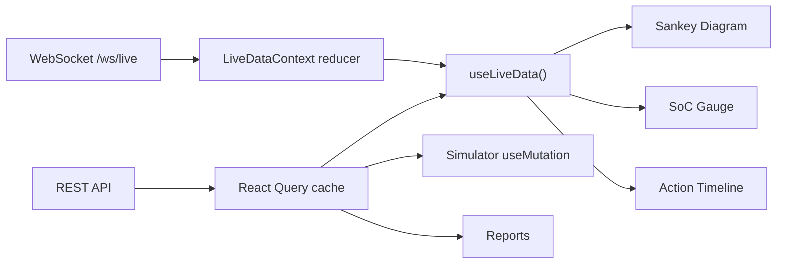

# VPP Command Bridge — Pair B Detailed Implementation Plan

Expands the 12-hour brief into buildable steps: a 2-dev work split, locked data contracts, phase-by-phase code stubs, acceptance checks, and a risk register with a cut list.

**Contents:** (1) How to use this plan · (2) Two corrections to the original brief · (3) Definition of done · (4) Lock the data contracts first · (5) Architecture at a glance · (6) Hour-by-hour build guide · (7) Component spec sheet · (8) State management plan · (9) Testing & QA checklist · (10) Risk register & cut list · (11) Deployment runbook · (12) Final pre-demo checklist

---

## 1. How to Use This Plan

"Pair B" is treated here as **two developers** working in parallel almost the whole sprint. They only need to agree on one thing up front — the type contracts in Section 4 — after that the visual layer and the data layer barely block each other.

- **Dev 1 — "Viz":** every chart/gauge/animation component (Sankey, SoC Gauge, Action Timeline, Forecast Fan Chart, Report table, motion polish).
- **Dev 2 — "Data":** types, mock data/MSW, the WebSocket hook, React Query wiring, the simulator mutation, Docker/deploy.

Each hour block below is split into Dev 1 / Dev 2 tracks so you can actually run them concurrently instead of serially.

---

## 2. Two Corrections to the Original Brief

Both commands in the original H0–H1 step are stale as of today (Sep 2026) — worth fixing before anyone copy-pastes them:

1. **`npx shadcn-ui@latest init` → `npx shadcn@latest init`.** The `shadcn-ui` package name was retired; the CLI is now published as `shadcn`. Same for `add`: `npx shadcn@latest add button card ...`.
2. **`npx create-next-app@latest` today installs Next 16.x, not 14.** Decide this explicitly rather than by accident:
   - **Recommended for this sprint:** just take latest (16.2). Everything in this plan is client-heavy (`'use client'` dashboards), so the one breaking change that actually matters across 14→15→16 — `params`/`searchParams` becoming async in Server Components — won't touch you.
   - **If you want zero surprises instead:** pin it — `npx create-next-app@14 frontend --ts --tailwind --eslint --app --src-dir --import-alias "@/*"`.

**A third thing to nail down before H0, not a correction but a silent trap:** confirm with Pair A whether `/ws/live` is a **raw WebSocket** server (e.g. FastAPI/`websockets` in Python) or a **Socket.IO** server. These are different wire protocols — `socket.io-client` cannot talk to a plain `ws` server and vice versa. Everything below assumes **raw WebSocket** (`new WebSocket(url)`). If Pair A is actually running Socket.IO, swap the hook to `io(url)` from `socket.io-client` instead — a 10-minute fix now, a confusing 90-minute debug session at H6 if you find out then.

---

## 3. Definition of Done — with exact verification commands

| Metric | Target | Verify with |
| :--- | :--- | :--- |
| Time to Interactive | < 2.5s local / < 1.5s Vercel | Chrome DevTools → Performance → record a reload, or `npx unlighthouse --site http://localhost:3000` |
| Real-time latency | < 200ms (WS msg → UI update) | Built into the `useLiveData` hook below via `performance.now()` |
| Schema compliance | Zero `any` in API types | `npx tsc --noEmit` passes; Zod `safeParse` on every WS/REST boundary (not just types — runtime checks) |
| Accessibility | 0 critical / 0 serious | `npx @axe-core/cli http://localhost:3000 --exit` |
| Mobile usable | Sankey → table fallback, timeline scrolls | Chrome DevTools device toolbar at iPad (1024px) and a ~800px Android tablet width |
| Offline resilience | No crash on a 30s WS drop | DevTools → Network → Offline for 30s → confirm "Reconnecting…" banner → back online → confirm auto-recovery, no manual refresh |

---

## 4. Lock the Data Contracts First (do this in the first 15 minutes)

This is the single highest-leverage step in the whole sprint. Agree on this shape with Pair A *before* either of you writes a component — rewriting Sankey/Gauge props at H6 during "real integration" is the most common way hackathon frontends lose an hour they don't have.

```typescript
// src/types/index.ts — source of truth. Mirror this in Pair A's schemas/*.
export type AssetType =
  | 'solar' | 'wind' | 'battery' | 'grid' | 'load' | 'critical_load' | 'export' | 'curtail';

export interface Asset {
  id: string;
  type: AssetType;
  label: string;
  capacityKw: number;
}

export interface Telemetry {
  timestamp: string; // ISO 8601
  socPct: number; // 0-100
  flowsKw: Record<AssetType, number>; // signed: +generation/import, -consumption/export
  gridStatus: 'import' | 'export' | 'islanded';
  autonomyPct: number;
  savingsPerHour: number; // ₹/hr
}

export type ActionPriority = 'HIGH' | 'MED' | 'LOW' | 'INFO';

export interface ForecastPoint {
  timestamp: string;
  p10: number;
  p50: number;
  p90: number;
  tariff: number;
  socProjected: number;
}

export interface ActionItem {
  id: string;
  timestamp: string;
  icon: string; // lucide icon name, e.g. "battery-charging"
  title: string;
  reason: string;
  priority: ActionPriority;
  forecast?: ForecastPoint[];
}

export interface ActionPlan {
  generatedAt: string;
  actions: ActionItem[];
}

export type WSMessage =
  | { type: 'telemetry'; payload: Telemetry }
  | { type: 'action_plan'; payload: ActionPlan }
  | { type: 'alert'; payload: { level: 'info' | 'warning' | 'critical'; message: string } };

export interface SimulationInput {
  batteryCapacityKwh: number;
  exportLimitKw: number;
  carbonPriceInrPerTon: number;
  criticalLoadPct: number;
}

export interface SimulationResult {
  annualSavingsInr: number;
  co2eAvoidedTons: number;
  gridIndependencePct: number;
  bessCyclesPerYear: number;
  baseline: SimulationInput & { annualSavingsInr: number };
}
```

```typescript
// src/lib/validations.ts — runtime guardrails so a backend contract drift
// fails loudly in the console instead of silently rendering garbage.
import { z } from 'zod';

export const TelemetrySchema = z.object({
  timestamp: z.string(),
  socPct: z.number().min(0).max(100),
  flowsKw: z.record(z.string(), z.number()),
  gridStatus: z.enum(['import', 'export', 'islanded']),
  autonomyPct: z.number(),
  savingsPerHour: z.number(),
});

export const ActionItemSchema = z.object({
  id: z.string(),
  timestamp: z.string(),
  icon: z.string(),
  title: z.string(),
  reason: z.string(),
  priority: z.enum(['HIGH', 'MED', 'LOW', 'INFO']),
});

export const WSMessageSchema = z.discriminatedUnion('type', [
  z.object({ type: z.literal('telemetry'), payload: TelemetrySchema }),
  z.object({
    type: z.literal('action_plan'),
    payload: z.object({ generatedAt: z.string(), actions: z.array(ActionItemSchema) }),
  }),
  z.object({
    type: z.literal('alert'),
    payload: z.object({ level: z.enum(['info', 'warning', 'critical']), message: z.string() }),
  }),
]);
```

**Action:** paste this into a shared doc/Slack, get a thumbs-up from Pair A, *then* start the clock on H0.

---

## 5. Architecture at a Glance



Two data paths, deliberately kept separate:

- **Cold data** (forecast, assets, reports, simulation results) is fetched over REST and lives in **React Query**'s cache — it has a natural request/response shape and benefits from caching, retries, and loading states for free.
- **Hot data** (telemetry ticks, new action plans, alerts) arrives over the **WebSocket** and lives in a small reducer exposed through `useLiveData()` — it's push-based and doesn't fit the request/response model React Query is built for.

Both are read by components through hooks; no component talks to `fetch` or `WebSocket` directly.

---

## 6. Hour-by-Hour Build Guide

### H0–H1 · Walking Skeleton

**Dev 1 (Viz):**
- Scaffold the app, install shadcn components, build `app/layout.tsx` (sidebar + header) and empty route shells.
- Set the design tokens now so nobody argues about colors later.

**Dev 2 (Data):**
- Write `lib/mockData.ts` matching the types above exactly.
- Set up MSW so every component built after this point already has real-shaped data.

```bash
# Core scaffold
npx create-next-app@latest frontend --ts --tailwind --eslint --app --src-dir --import-alias "@/*"
cd frontend

# UI kit (corrected command — see Section 2)
npx shadcn@latest init
npx shadcn@latest add button card badge select slider tooltip tabs scroll-area skeleton progress alert dialog

# Data, validation, charts
npm install @tanstack/react-query recharts zod
npm install -D msw

# Reports, i18n, icons, motion, theme, toast
npm install html2pdf.js i18next react-i18next lucide-react framer-motion next-themes sonner
```

```css
/* src/app/globals.css — design tokens, decide once */
:root {
  --color-solar: #f5a623;
  --color-wind: #14b8a6;
  --color-battery-high: #22c55e;
  --color-battery-mid: #f59e0b;
  --color-battery-low: #ef4444;
  --color-grid: #3b82f6;
  --color-critical: #dc2626;
  --color-track: #e5e7eb;
}
.dark {
  --color-track: #27272a;
}
```

```typescript
// src/mocks/handlers.ts
import { http, HttpResponse } from 'msw';
import { mockForecast, mockAssets } from '@/lib/mockData';

export const handlers = [
  http.get('/api/forecast', () => HttpResponse.json(mockForecast)),
  http.get('/api/assets', () => HttpResponse.json(mockAssets)),
  http.post('/api/simulate', async ({ request }) => {
    const body = (await request.json()) as Record<string, number>;
    return HttpResponse.json({
      annualSavingsInr: 1_240_000,
      co2eAvoidedTons: 86,
      gridIndependencePct: 71,
      bessCyclesPerYear: 310,
      baseline: { ...body, annualSavingsInr: 640_000 },
    });
  }),
];
```

```typescript
// src/mocks/browser.ts
import { setupWorker } from 'msw/browser';
import { handlers } from './handlers';
export const worker = setupWorker(...handlers);
```

**Done when:** `npm run dev` shows the sidebar shell across all three routes, no console errors, and hitting `/api/forecast` in the network tab returns mock JSON.

---

### H1–H3 · Command Bridge (Core Dashboard)

**Dev 1 (Viz):** Sankey + KPI strip.
**Dev 2 (Data):** SoC Gauge (it's mostly math, put it with Data) + the first version of `useLiveData`.

```tsx
// src/components/dashboard/SoCGauge.tsx
'use client';

function polarToCartesian(cx: number, cy: number, r: number, angleDeg: number) {
  const rad = ((angleDeg - 90) * Math.PI) / 180;
  return { x: cx + r * Math.cos(rad), y: cy + r * Math.sin(rad) };
}

function arcPath(cx: number, cy: number, r: number, startAngle: number, endAngle: number) {
  const start = polarToCartesian(cx, cy, r, endAngle);
  const end = polarToCartesian(cx, cy, r, startAngle);
  const largeArc = endAngle - startAngle <= 180 ? 0 : 1;
  return `M ${start.x} ${start.y} A ${r} ${r} 0 ${largeArc} 0 ${end.x} ${end.y}`;
}

export function SoCGauge({ socPct }: { socPct: number }) {
  const sweep = 270; // gauge sweeps -135° to +135°
  const startAngle = -135;
  const endAngle = startAngle + (sweep * socPct) / 100;
  const zoneColor =
    socPct < 20 ? 'var(--color-battery-low)' : socPct > 80 ? 'var(--color-battery-high)' : 'var(--color-battery-mid)';

  return (
    <svg viewBox="0 0 200 200" className="w-full h-full">
      <path d={arcPath(100, 100, 80, startAngle, startAngle + sweep)} stroke="var(--color-track)" strokeWidth={16} fill="none" strokeLinecap="round" />
      <path
        d={arcPath(100, 100, 80, startAngle, endAngle)}
        stroke={zoneColor}
        strokeWidth={16}
        fill="none"
        strokeLinecap="round"
        className={socPct >= 100 ? 'animate-pulse' : ''}
        style={{ transition: 'all 600ms ease-out' }}
      />
      <text x="100" y="105" textAnchor="middle" fontSize="32" fontWeight={700} fill="currentColor">
        {Math.round(socPct)}%
      </text>
    </svg>
  );
}
```

```tsx
// src/components/dashboard/SankeyDiagram.tsx — starter skeleton
'use client';
import { Sankey, Tooltip, ResponsiveContainer } from 'recharts';
import type { Telemetry } from '@/types';

export function SankeyDiagram({ flows }: { flows: Telemetry['flowsKw'] }) {
  const nodes = [{ name: 'Solar' }, { name: 'Wind' }, { name: 'Grid' }, { name: 'Load' }, { name: 'Battery' }, { name: 'Export' }, { name: 'Curtail' }];
  // NOTE: this link math is a placeholder — finalize the exact import/export/
  // curtailment sign convention with Pair A, then fill this in for real.
  const links = [
    { source: 0, target: 3, value: Math.max(flows.solar ?? 0, 0) },
    { source: 1, target: 3, value: Math.max(flows.wind ?? 0, 0) },
    { source: 2, target: 3, value: Math.max(-(flows.grid ?? 0), 0) },
  ].filter((l) => l.value > 0);

  return (
    <ResponsiveContainer width="100%" height={320}>
      <Sankey data={{ nodes, links }} nodePadding={24} link={{ stroke: 'var(--color-grid)' }}>
        <Tooltip />
      </Sankey>
    </ResponsiveContainer>
  );
}
```

```typescript
// src/hooks/useLiveData.ts — H1–H3 version (reconnect logic comes at H6–H8)
'use client';
import { createContext, useContext, useEffect, useReducer, type ReactNode } from 'react';
import { WSMessageSchema } from '@/lib/validations';
import type { Telemetry, ActionPlan } from '@/types';

interface LiveState {
  telemetry: Telemetry | null;
  actionPlan: ActionPlan | null;
  alerts: { level: string; message: string }[];
  connected: boolean;
}

type LiveAction =
  | { type: 'SET_TELEMETRY'; payload: Telemetry }
  | { type: 'SET_ACTION_PLAN'; payload: ActionPlan }
  | { type: 'ADD_ALERT'; payload: { level: string; message: string } }
  | { type: 'SET_CONNECTED'; payload: boolean };

function reducer(state: LiveState, action: LiveAction): LiveState {
  switch (action.type) {
    case 'SET_TELEMETRY': return { ...state, telemetry: action.payload };
    case 'SET_ACTION_PLAN': return { ...state, actionPlan: action.payload };
    case 'ADD_ALERT': return { ...state, alerts: [...state.alerts, action.payload].slice(-5) };
    case 'SET_CONNECTED': return { ...state, connected: action.payload };
  }
}

const LiveDataContext = createContext<LiveState | null>(null);

export function LiveDataProvider({ children }: { children: ReactNode }) {
  const [state, dispatch] = useReducer(reducer, { telemetry: null, actionPlan: null, alerts: [], connected: false });

  useEffect(() => {
    const ws = new WebSocket(process.env.NEXT_PUBLIC_WS_URL!);
    ws.onopen = () => dispatch({ type: 'SET_CONNECTED', payload: true });
    ws.onclose = () => dispatch({ type: 'SET_CONNECTED', payload: false });
    ws.onmessage = (event) => {
      const t0 = performance.now();
      const parsed = WSMessageSchema.safeParse(JSON.parse(event.data));
      if (!parsed.success) { console.warn('Bad WS payload', parsed.error); return; }
      const msg = parsed.data;
      if (msg.type === 'telemetry') dispatch({ type: 'SET_TELEMETRY', payload: msg.payload });
      if (msg.type === 'action_plan') dispatch({ type: 'SET_ACTION_PLAN', payload: msg.payload });
      if (msg.type === 'alert') dispatch({ type: 'ADD_ALERT', payload: msg.payload });
      console.debug('WS handled in', (performance.now() - t0).toFixed(1), 'ms'); // watch the <200ms budget
    };
    return () => ws.close();
  }, []);

  return <LiveDataContext.Provider value={state}>{children}</LiveDataContext.Provider>;
}

export function useLiveData() {
  const ctx = useContext(LiveDataContext);
  if (!ctx) throw new Error('useLiveData must be used inside LiveDataProvider');
  return ctx;
}
```

**Done when:** mock telemetry updates the gauge and Sankey smoothly, the console shows sub-200ms handling times, and `gridStatus`/`autonomyPct`/`savingsPerHour` render in the KPI strip.

---

### H3–H4 · Action Center

**Dev 1 (Viz):** `ActionTimeline` + priority badge colors (`HIGH` red/pulse, `MED` amber, `LOW` green, `INFO` blue).
**Dev 2 (Data):** `ActionDetailModal` + `ForecastFanChart` + i18n scaffolding.

```tsx
// src/components/dashboard/ForecastFanChart.tsx
// Recharts has no native "band" area, so stack a transparent p10 base
// under a p90-p10 band — this is the actual trick, not just "add an Area".
'use client';
import { AreaChart, Area, Line, XAxis, YAxis, Tooltip, ReferenceLine, ResponsiveContainer } from 'recharts';
import type { ForecastPoint } from '@/types';

export function ForecastFanChart({ data, currentSoc }: { data: ForecastPoint[]; currentSoc: number }) {
  const chartData = data.map((d) => ({ ...d, band: d.p90 - d.p10 }));
  return (
    <ResponsiveContainer width="100%" height={240}>
      <AreaChart data={chartData}>
        <XAxis dataKey="timestamp" tickFormatter={(t) => `${new Date(t).getHours()}:00`} />
        <YAxis />
        <Tooltip labelFormatter={(t) => new Date(t).toLocaleTimeString()} />
        <Area dataKey="p10" stackId="fan" stroke="none" fill="transparent" />
        <Area dataKey="band" stackId="fan" stroke="none" fill="var(--color-solar)" fillOpacity={0.2} />
        <Line dataKey="p50" stroke="var(--color-solar)" strokeWidth={2} dot={false} />
        <ReferenceLine y={currentSoc} stroke="var(--color-battery-mid)" strokeDasharray="4 4" label="Current SoC" />
      </AreaChart>
    </ResponsiveContainer>
  );
}
```

```json
// public/locales/en/common.json
{
  "action.charge": "Charge Battery",
  "action.discharge": "Discharge Battery",
  "grid.import": "Importing from Grid",
  "grid.export": "Exporting to Grid",
  "grid.islanded": "Islanded (Off-Grid)",
  "kpi.autonomy": "Autonomy",
  "kpi.savings": "Savings this hour"
}
```

```json
// public/locales/hi/common.json — starter translations, get a native speaker to sanity-check before H8
{
  "action.charge": "बैटरी चार्ज करें",
  "action.discharge": "बैटरी डिस्चार्ज करें",
  "grid.import": "ग्रिड से आयात हो रहा है",
  "grid.export": "ग्रिड को निर्यात हो रहा है",
  "grid.islanded": "आइलैंडेड (ऑफ-ग्रिड)",
  "kpi.autonomy": "स्वायत्तता",
  "kpi.savings": "इस घंटे की बचत"
}
```

**Done when:** clicking an action card opens the modal with the fan chart, tariff bar, and SoC line; the language toggle swaps every visible string, not just a few.

---

### H4–H5 · Strategy Simulator

**Dev 1 (Viz):** `ControlPanel` (4 shadcn sliders) + `ResultCards` + baseline-vs-proposed bar chart.
**Dev 2 (Data):** `useSimulator` mutation.

```typescript
// src/hooks/useSimulator.ts
import { useMutation } from '@tanstack/react-query';
import type { SimulationInput, SimulationResult } from '@/types';

export function useSimulator() {
  return useMutation<SimulationResult, Error, SimulationInput>({
    mutationFn: async (input) => {
      const res = await fetch(`${process.env.NEXT_PUBLIC_API_URL}/api/simulate`, {
        method: 'POST',
        headers: { 'Content-Type': 'application/json' },
        body: JSON.stringify(input),
      });
      if (!res.ok) throw new Error(`Simulation failed: ${res.status}`);
      return res.json();
    },
  });
}
```

Usage sketch in `ControlPanel.tsx`: four `<Slider>`s hold local state, a "Re-Optimize Year" button calls `mutate(input)`, `isPending` drives the loading skeleton, `data` drives `ResultCards`.

**Done when:** dragging any slider then clicking Re-Optimize shows a skeleton, then real numbers, and comparison bars toggle between baseline and proposed.

---

### H5–H6 · Reports & Polish

**Dev 1 (Viz):** `ReportTable` + PDF export + Framer Motion pass on cards already built.
**Dev 2 (Data):** dark mode (`next-themes`), toasts (`sonner`), an accessibility pass, mobile breakpoint testing.

```tsx
// PDF export trigger, referenced from ReportTable.tsx
'use client';
import html2pdf from 'html2pdf.js';

export function downloadReportPdf() {
  const el = document.getElementById('print-report');
  if (!el) return;
  html2pdf()
    .set({
      margin: 10,
      filename: `vpp-monthly-report-${new Date().toISOString().slice(0, 7)}.pdf`,
      html2canvas: { scale: 2 },
      jsPDF: { unit: 'mm', format: 'a4', orientation: 'landscape' },
    })
    .from(el)
    .save();
}
```

```css
/* globals.css — print rules for the hidden report div */
@media print {
  @page { size: A4 landscape; margin: 2cm; }
  body * { visibility: hidden; }
  #print-report, #print-report * { visibility: visible; }
  #print-report { position: absolute; left: 0; top: 0; width: 100%; }
}
```

**Done when:** the PDF downloads with correct A4 layout, dark mode toggles cleanly, and `npx @axe-core/cli` comes back with 0 critical/serious issues.

---

### H6–H8 · Real Integration & Bug Bash

**Dev 1 (Viz):** wrap Sankey and Timeline in an error boundary; swap any remaining mock imports for the real API base URL.
**Dev 2 (Data):** WebSocket reconnection with backoff; verify `wss://` (not `ws://`) once deployed.

```typescript
// src/hooks/useLiveData.ts — H6–H8 upgrade: reconnect with exponential backoff
useEffect(() => {
  let socket: WebSocket;
  let retryMs = 1000;
  let closedByUs = false;

  function handleMessage(event: MessageEvent) {
    /* same body as the H1–H3 onmessage handler above */
  }

  function connect() {
    socket = new WebSocket(process.env.NEXT_PUBLIC_WS_URL!);
    socket.onopen = () => { dispatch({ type: 'SET_CONNECTED', payload: true }); retryMs = 1000; };
    socket.onmessage = handleMessage;
    socket.onclose = () => {
      dispatch({ type: 'SET_CONNECTED', payload: false });
      if (closedByUs) return;
      setTimeout(connect, retryMs);
      retryMs = Math.min(retryMs * 2, 30_000); // 1s → 2s → 4s → ... capped at 30s
    };
  }

  connect();
  return () => { closedByUs = true; socket.close(); };
}, []);
```

```tsx
// src/components/common/ChartErrorBoundary.tsx
'use client';
import { Component, type ReactNode } from 'react';

export class ChartErrorBoundary extends Component<{ children: ReactNode; fallback: ReactNode }, { hasError: boolean }> {
  state = { hasError: false };
  static getDerivedStateFromError() { return { hasError: true }; }
  componentDidCatch(error: unknown) { console.error('Chart crashed:', error); }
  render() { return this.state.hasError ? this.props.fallback : this.props.children; }
}
// Usage: <ChartErrorBoundary fallback={<SankeyTableFallback />}><SankeyDiagram flows={...} /></ChartErrorBoundary>
```

**Reminder:** if you deploy behind HTTPS (Vercel does this by default), `NEXT_PUBLIC_WS_URL` must be `wss://…`, not `ws://…` — browsers block mixed-content WebSocket connections from an HTTPS page. Easy to miss because it works fine on `localhost`.

**Done when:** killing the backend WS process and restarting it triggers "Reconnecting…" then automatic recovery within 30s, with no manual refresh; pulling a chart's data to `undefined` shows the fallback table, not a blank screen.

---

### H8–H10 · Demo Mode & Video

**Dev 1 (Viz):** Framer Motion pass — card slide-in, gauge needle sweep, Sankey pulse.
**Dev 2 (Data):** hidden `DemoControlPanel` + rehearse the 3-minute take.

```tsx
// src/components/common/DemoControlPanel.tsx
'use client';
import { useEffect, useState } from 'react';

export function DemoControlPanel() {
  const [open, setOpen] = useState(false);
  useEffect(() => {
    function onKey(e: KeyboardEvent) {
      if (e.metaKey && e.shiftKey && e.key.toLowerCase() === 'd') setOpen((o) => !o);
    }
    window.addEventListener('keydown', onKey);
    return () => window.removeEventListener('keydown', onKey);
  }, []);
  if (!open) return null;
  const scenarios = ['sunny_day', 'cloud_cover', 'evening_peak', 'grid_outage'];
  return (
    <div className="fixed bottom-4 right-4 z-50 rounded-lg border bg-background p-3 shadow-lg space-y-1">
      {scenarios.map((s) => (
        <button
          key={s}
          className="block w-full text-left text-sm"
          onClick={() =>
            fetch(`${process.env.NEXT_PUBLIC_API_URL}/demo/scenario`, {
              method: 'POST',
              headers: { 'Content-Type': 'application/json' },
              body: JSON.stringify({ scenario: s }),
            })
          }
        >
          {s}
        </button>
      ))}
    </div>
  );
}
```

**Done when:** the full demo flow (dashboard → cloud event → action appears → simulator → PDF) has been rehearsed twice back-to-back with zero console errors, and the video is recorded.

---

### H10–H12 · Freeze & Deploy

**Dev 1 (Viz):** fix any remaining `tsc` errors, run a clean production build.
**Dev 2 (Data):** Dockerize, deploy, write the README.

```dockerfile
# Dockerfile — multi-stage, standalone output
FROM node:20-alpine AS deps
WORKDIR /app
COPY package.json package-lock.json ./
RUN npm ci

FROM node:20-alpine AS builder
WORKDIR /app
COPY --from=deps /app/node_modules ./node_modules
COPY . .
RUN npm run build

FROM node:20-alpine AS runner
WORKDIR /app
ENV NODE_ENV=production
COPY --from=builder /app/public ./public
COPY --from=builder /app/.next/standalone ./
COPY --from=builder /app/.next/static ./.next/static
EXPOSE 3000
CMD ["node", "server.js"]
```

```javascript
// next.config.js
/** @type {import('next').NextConfig} */
const nextConfig = {
  output: 'standalone',
  images: { domains: [] },
};
module.exports = nextConfig;
```

**Vercel path:** `vercel link` → set `NEXT_PUBLIC_API_URL` and `NEXT_PUBLIC_WS_URL` (as `wss://…`) for both Preview and Production in the dashboard → `vercel --prod`.

**Done when:** the production build/deploy is verified end to end (not just `npm run dev`), and the README has screenshots, an env-var table, and "how to run locally."

---

## 7. Component Spec Sheet

| Component | Key props | Internal state | Notes |
| :--- | :--- | :--- | :--- |
| `SankeyDiagram` | `flows: Record<AssetType, number>` | none (pure) | Recompute only on the 15-min tick, not every telemetry frame — see original cheat code |
| `SoCGauge` | `socPct: number` | none (pure) | Color zones per Section 4 thresholds |
| `KPIStrip` | `autonomyPct, gridStatus, savingsPerHour` | none | |
| `ActionTimeline` | `actions: ActionItem[]`, `onSelect(action)` | scroll position | Horizontal `<ScrollArea>` |
| `ActionDetailModal` | `action: ActionItem \| null`, `onClose()` | none | Renders `ForecastFanChart` + tariff bar + SoC line |
| `ForecastFanChart` | `data: ForecastPoint[]`, `currentSoc: number` | none | See H3–H4 banding trick |
| `ControlPanel` | `onSimulate(input: SimulationInput)` | 4 slider values | |
| `ResultCards` | `result: SimulationResult` | none | |
| `ReportTable` | `rows: ReportRow[]` | none | Wraps content in `id="print-report"` |
| `DemoControlPanel` | none | `open: boolean` | Cmd+Shift+D toggles it |
| `LanguageToggle` / `ThemeToggle` | none | reads i18n / next-themes | |

---

## 8. State Management Plan

No new state library needed — React Query already covers cold data, and a single `LiveDataProvider` (Section 6, H1–H3) covers hot data via `useReducer` + Context. Wrap this provider once in `app/layout.tsx` alongside `QueryProvider`, `ThemeProvider`, and `I18nProvider`, and every component reaches live data through `useLiveData()` — no prop drilling, no extra dependency. If the team finds the reducer growing unwieldy past H4, `zustand` is a ~1kb drop-in that removes the Context boilerplate, but it's not needed to hit any of the targets in this plan.

---

## 9. Testing & QA Checklist

- [ ] `tsc --noEmit` passes with zero `any` in files under `types/` and `lib/`
- [ ] Every WS message is validated with `WSMessageSchema.safeParse` before it reaches a reducer
- [ ] Axe CLI: 0 critical / 0 serious
- [ ] Lighthouse/DevTools: TTI under target on both local and deployed builds
- [ ] Manual: throttle network to Offline for 30s mid-session, confirm reconnect banner + auto-recovery
- [ ] Manual: resize to iPad and ~800px widths, confirm Sankey→table fallback and full-width timeline cards
- [ ] Manual: toggle language, confirm no leftover English strings
- [ ] Manual: toggle dark mode, confirm gauge/Sankey colors still read clearly

---

## 10. Risk Register & Cut List

| Risk | Likelihood | Impact | Mitigation |
| :--- | :--- | :--- | :--- |
| Pair A's schema drifts after H1 | High | High | Zod validation fails loudly in console instead of silently breaking; re-sync the moment it happens |
| Sankey re-renders janky at high tick rate | Med | Med | Freeze Sankey to the 15-min tick only; keep gauge/KPIs on the fast path |
| WebSocket flakiness on venue wifi | Med | High | Reconnect logic (H6–H8) + last-known-good state so the UI never blanks |
| Simulator backend slow (>5s) | Med | Low | Loading skeleton + timeout/retry, set expectations with a short message |
| Running out of time before H10 | High | High | Use the cut list below, in order |
| Hindi translations awkward | Low | Med | 2-minute native-speaker review before H8 |

**If behind schedule, cut in this order** (each is independently removable without breaking the demo):
1. Mobile/tablet polish — ship desktop-only, note it in the README.
2. Framer Motion polish — functional beats flashy.
3. Baseline-vs-proposed comparison chart — keep just the KPI cards.
4. Dark mode.

**Never cut:** WS reconnect logic, the Sankey/Gauge real-time render, and PDF export — these three are what make the "magic" and the "zero training" claims actually true in front of judges.

---

## 11. Deployment Runbook

1. `npm run build` locally, fix any TS errors surfaced only in production mode.
2. Build and smoke-test the Docker image locally (`docker build . -t vpp-frontend && docker run -p 3000:3000 vpp-frontend`) before handing it to whoever owns infra.
3. Push to Vercel (or hand the image to Pair C for `docker-compose`).
4. Confirm env vars are set for **both** Preview and Production: `NEXT_PUBLIC_API_URL`, `NEXT_PUBLIC_WS_URL` (remember `wss://` in production).
5. README checklist: screenshots of each of the 3 routes, the env-var table, "how to run locally," and one line on known limitations (e.g. "mobile view is best-effort").

---

## 12. Final Pre-Demo Checklist (T-15 min)

- [ ] Hard-refresh once to clear any stale cache
- [ ] Confirm `/demo/scenario` responds for all 4 scenarios
- [ ] Close DevTools console (harmless warnings still look bad on a projector)
- [ ] Have one PDF report pre-downloaded as a backup in case live export hiccups
- [ ] Screen resolution and audio set for recording
- [ ] Laptop charged, notifications muted
